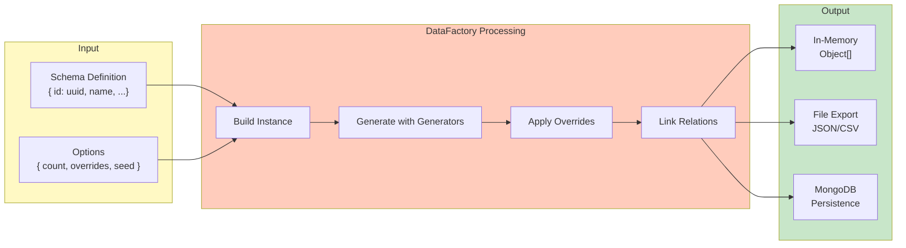
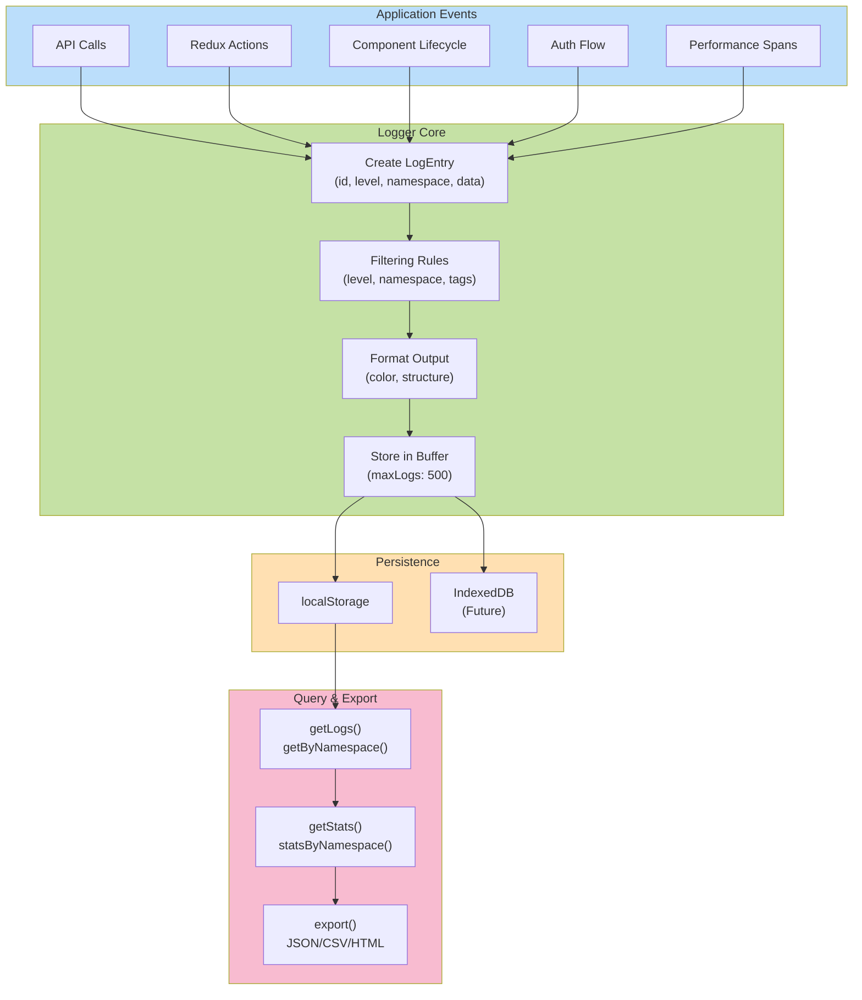
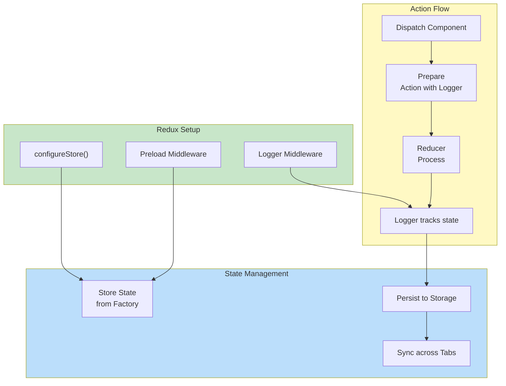
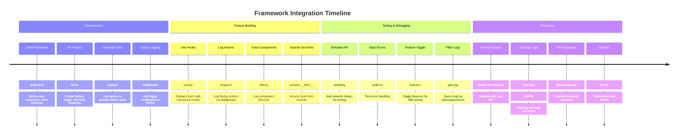
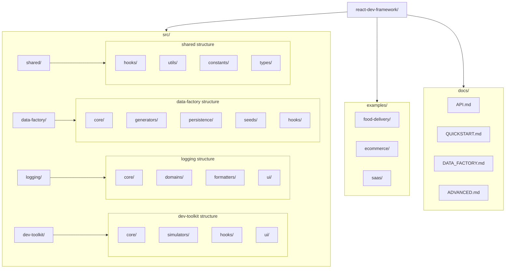
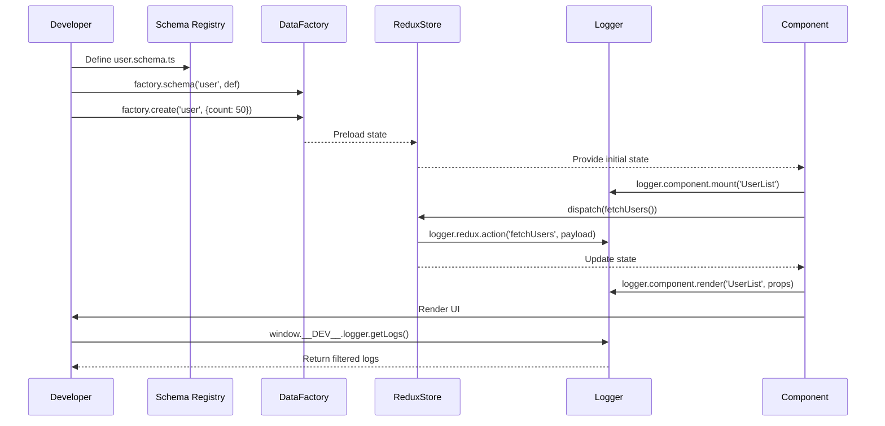
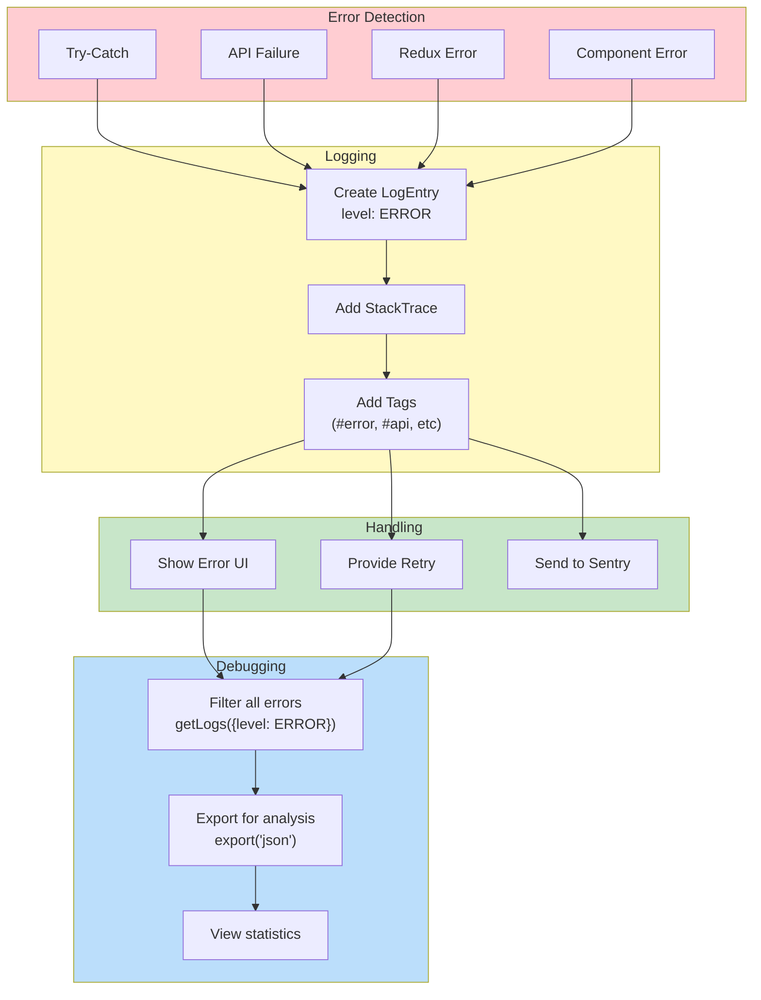
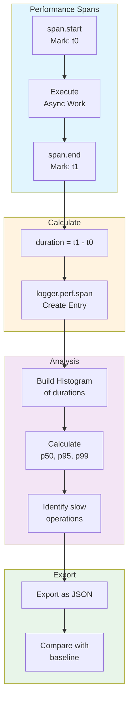

# React Developer Framework - Visual Architecture

## System Architecture Diagram

```mermaid
graph TB
    subgraph RDF["React Developer Framework (RDF)"]
        subgraph DF["DataFactory<br/>(Schema-Driven)"]
            S1["Schema Definition<br/>(SchemaDef)"]
            FG["Field Generators<br/>(Faker, Custom)"]
            FR["Factory Registry<br/>(In-Memory)"]
            PE["Persistence<br/>(File, DB, JSON)"]
            S1 --> FG
            FG --> FR
            FR --> PE
        end

        subgraph LOG["Logger<br/>(Structured)"]
            LC["Logger Core<br/>(LogEntry, LogLevel)"]
            DL["Domain Loggers<br/>(API, Redux, Component)"]
            FLT["Filtering & Query<br/>(Namespace, Level, Tags)"]
            EXP["Export<br/>(JSON, CSV, HTML)"]
            LC --> DL
            DL --> FLT
            FLT --> EXP
        end

        subgraph DT["DevToolkit<br/>(Utilities)"]
            API["API Simulator<br/>(Delays, Errors)"]
            FT["Feature Toggle<br/>(Dev Features)"]
            ES["Error Simulator<br/>(Error Injection)"]
            API --> FT
            FT --> ES
        end

        subgraph SH["Shared Layer<br/>(Reusable)"]
            H["Hooks<br/>(useApi, useLocalStorage)"]
            U["Utils<br/>(Formatters, Validators)"]
            C["Constants<br/>(HTTP, Errors)"]
            T["Types<br/>(Common Interfaces)"]
            H --> U
            U --> C
            C --> T
        end
    end

    subgraph APP["Your React App"]
        COMP["Components"]
        STORE["Redux Store"]
        SERV["Services/API"]
        COMP --> STORE
        STORE --> SERV
    end

    RDF --> APP
    DF -.->|Preload State| STORE
    LOG -.->|Track Flow| COMP
    LOG -.->|Track Actions| STORE
    LOG -.->|Track Requests| SERV
    DT -.->|Simulate| SERV
    SH -.->|Utilities| COMP

    style RDF fill:#e1f5ff
    style DF fill:#fff3e0
    style LOG fill:#f3e5f5
    style DT fill:#e8f5e9
    style SH fill:#fce4ec
    style APP fill:#f1f8e9
```



## Data Flow Architecture



## Logger Data Flow



## Component Integration Pattern

```mermaid
graph TD
    A["App Root"] -->|RDFProvider| B["Framework Context"]
    B -->|useFactory| C["Component A"]
    B -->|useLogger| D["Component B"]
    B -->|useDevMode| E["Component C"]
    
    C -->|create()| F["DataFactory"]
    D -->|info()| G["Logger"]
    E -->|setDelay()| H["API Simulator"]
    
    F -->|preload| I["Redux Store"]
    G -->|track| I
    H -->|simulate| J["API Layer"]
    
    J -->|fetch| K["Real Backend<br/>or Mock"]

    style A fill:#e3f2fd
    style B fill:#f3e5f5
    style C fill:#fff3e0
    style D fill:#f3e5f5
    style E fill:#e8f5e9
```

## Redux Integration with Framework



## Timeline: Integration Flow



## File Structure Deep Dive



## Usage Flow: From Schema to App



## Error Handling Flow



## Performance Monitoring Architecture



