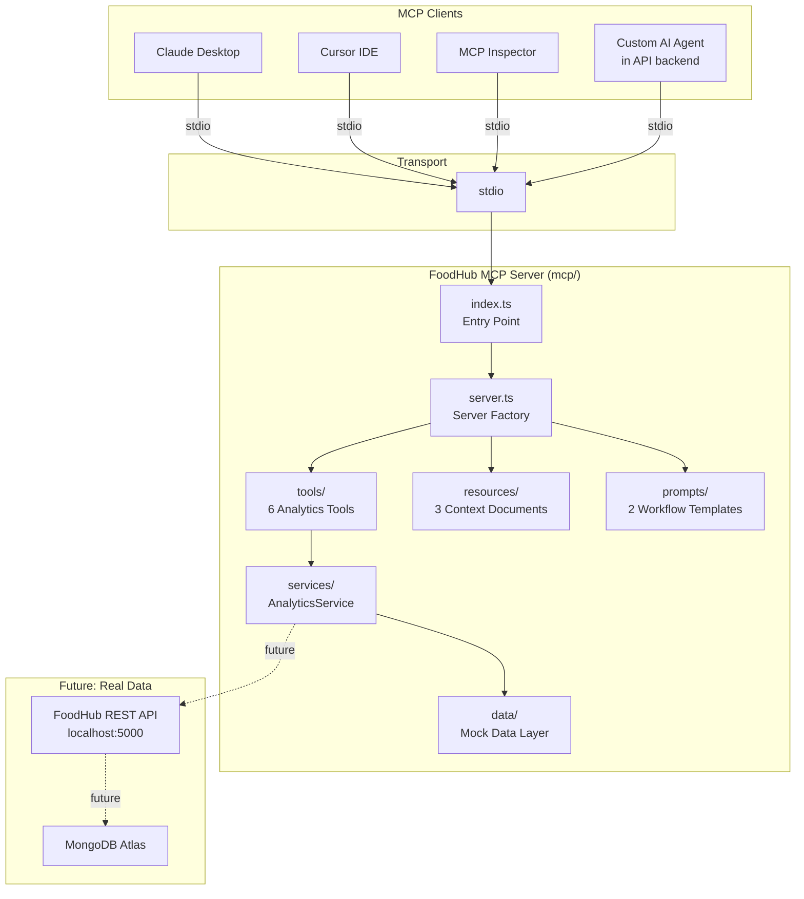

# FoodHub Analytics MCP Server

A production-quality **Model Context Protocol (MCP) server** that exposes analytics capabilities for the FoodHub food delivery platform. Built as a learning and portfolio project demonstrating correct MCP architecture, clean TypeScript design, and realistic analytics tooling.

---

## What This Is

This MCP server allows an AI agent (Claude, Cursor, or any MCP-compatible client) to **query FoodHub analytics data** using natural language — no SQL, no custom APIs. The agent calls **typed tools** to retrieve metrics, breakdowns, trends, and comparisons.

Example questions the agent can answer:
- *"What was our total revenue in November?"*
- *"Which city generated the most orders in Q4 2024?"*
- *"Compare December performance against November."*
- *"Show me the revenue trend for the last quarter."*
- *"Who are the top 5 restaurants this month?"*

---

## Why MCP?

The **Model Context Protocol** is an open standard that lets AI models interact with external tools and data sources in a structured, typed way. Instead of embedding business logic into a chatbot system prompt, MCP lets you:

- Define **tools** with strict input/output schemas
- Expose **resources** (read-only context documents)
- Create **prompts** (reusable workflow templates)

This makes AI integrations **composable, maintainable, and testable** — the same MCP server can be used by Claude Desktop, Cursor IDE, or a custom AI agent in your backend.

---

## Architecture



### Directory Structure

```
mcp/
├── src/
│   ├── index.ts              # Entry point — connects stdio transport
│   ├── server.ts             # McpServer factory — registers tools/resources/prompts
│   ├── tools/
│   │   ├── get-analytics-summary.tool.ts
│   │   ├── get-metrics.tool.ts
│   │   ├── compare-periods.tool.ts
│   │   ├── get-breakdown.tool.ts
│   │   ├── get-top-entities.tool.ts
│   │   ├── analyze-trend.tool.ts
│   │   └── index.ts
│   ├── resources/
│   │   └── index.ts          # metric-definitions, dimensions, data-coverage
│   ├── prompts/
│   │   └── index.ts          # weekly_business_review, restaurant_performance_audit
│   ├── services/
│   │   └── analytics.service.ts  # All query logic — swap here for real DB
│   └── data/
│       ├── restaurants.data.ts   # 20 restaurants, 6 cities
│       ├── orders.data.ts        # 60 orders across Q4 2024
│       ├── users.data.ts         # 20 users with segments
│       └── index.ts
├── .env.example
├── package.json
├── tsconfig.json
└── README.md
```

---

## MCP Concepts: Tools vs Resources vs Prompts

| Concept | What it is | When the agent uses it |
|---------|-----------|----------------------|
| **Tool** | A function the agent **calls** to execute logic and return computed results | "Get me the revenue breakdown by city" |
| **Resource** | A **document** the agent reads for background context | "What does cancellation_rate mean?" |
| **Prompt** | A **reusable workflow template** that pre-populates agent instructions | "Run the weekly business review" |

---

## Available Tools

### `get_analytics_summary`
Returns a high-level platform snapshot: revenue, orders, delivery success rate, cancellation rate, platform fees, AOV, top city, and top cuisine. Optionally scoped to a date range.

**Input:**
```json
{ "from": "2024-12-01", "to": "2024-12-31" }
```
**Output (excerpt):**
```json
{
  "scope": { "from": "2024-12-01", "to": "2024-12-31" },
  "metrics": {
    "revenue": { "total": 18147, "platformFees": 2996, "unit": "INR" },
    "orders": { "total": 30, "delivered": 28, "cancellationRate": 0.07 },
    "averageOrderValue": { "value": 648.11, "unit": "INR" }
  }
}
```

---

### `get_metrics`
Retrieves one or more specific metrics for a date range. Use when you need precise values without the full summary payload.

**Input:**
```json
{ "metrics": ["revenue", "avg_order_value"], "from": "2024-11-01", "to": "2024-11-30" }
```

---

### `compare_periods`
Compares two date ranges across revenue, orders, AOV, and cancellation rate. Returns absolute/percentage changes and a plain-language interpretation.

**Input:**
```json
{
  "period":   { "from": "2024-12-01", "to": "2024-12-31" },
  "baseline": { "from": "2024-11-01", "to": "2024-11-30" }
}
```
**Output (interpretation excerpt):**
> "Revenue grew by 38.2%. Order volume increased significantly (+53.3%). Cancellation rate improved."

---

### `get_breakdown`
Breaks down revenue/orders by city, cuisine, restaurant, payment method, user segment, or order status. Results include revenue share percentages.

**Input:**
```json
{ "dimension": "cuisine", "from": "2024-12-01", "to": "2024-12-31", "limit": 5 }
```

---

### `get_top_entities`
Returns ranked restaurants or users by revenue or order count.

**Input:**
```json
{ "entityType": "restaurant", "sortBy": "revenue", "limit": 5, "from": "2024-12-01", "to": "2024-12-31" }
```

---

### `analyze_trend`
Generates a time-series for a metric with trend direction, peak/trough dates, percent change first-to-last, and volatility classification.

**Input:**
```json
{ "metric": "revenue", "from": "2024-10-01", "to": "2024-12-31", "granularity": "month" }
```

---

## Available Resources

Read with `resources/read` or via MCP Inspector's Resources tab.

| URI | Description |
|-----|-------------|
| `foodhub://analytics/metric-definitions` | What each metric means, its unit, and how it is calculated |
| `foodhub://analytics/dimensions` | Valid breakdown dimensions and their available values |
| `foodhub://analytics/data-coverage` | Date range, record counts, and data source caveats |

---

## Available Prompts

| Name | Description |
|------|-------------|
| `weekly_business_review` | Structured weekly report: summary → trend → city/cuisine breakdown → top restaurants → WoW comparison |
| `restaurant_performance_audit` | Deep-dive audit for a named restaurant: rank, revenue share, MoM trajectory, recommendations |

---

## Mock Data Coverage

| Dataset | Count | Date Range |
|---------|-------|-----------|
| Restaurants | 20 (6 cities, 15 cuisines) | N/A (static) |
| Orders | 60 | 2024-10-01 → 2024-12-31 (Q4 2024) |
| Users | 20 (4 segments) | Joined 2022–2024 |

> All queries must use dates within **2024-10-01 to 2024-12-31** to return data.

---

## Installation

```bash
# From the mcp/ directory
cd mcp
npm install
```

---

## Running the Server

```bash
# Development (auto-restarts on file changes)
npm run dev

# Production build then run
npm run build
npm start

# Type-check without emitting
npm run typecheck
```

---

## Inspecting with MCP Inspector

The **MCP Inspector** is the official browser-based tool for testing MCP servers interactively. It lets you call tools, read resources, and use prompts without any AI client.

```bash
# Build first
npm run build

# Launch inspector (opens browser at http://localhost:5173)
npm run inspect
```

Or against the TypeScript source directly (no build required):
```bash
npm run inspect:dev
```

In the Inspector UI you can:
- Browse all registered **Tools**, **Resources**, and **Prompts**
- Call any tool with custom inputs and see the full JSON response
- Read resource documents
- Execute prompts with parameters

---

## Claude Desktop Integration

Add to `claude_desktop_config.json` (typically at `%APPDATA%\Claude\claude_desktop_config.json` on Windows):

```json
{
  "mcpServers": {
    "foodhub-analytics": {
      "command": "node",
      "args": ["C:\\Aa\\vsCode\\mern\\z\\FOODHUB\\mcp\\dist\\index.js"],
      "env": {
        "NODE_ENV": "production"
      }
    }
  }
}
```

Build first: `npm run build`

Then restart Claude Desktop. The tools will appear in the tools panel.

---

## How an AI Agent Consumes This Server

The intended production flow is:

```
User → React Admin Frontend
           ↓ HTTP request
      Backend AI Agent Service  (e.g. Express + @anthropic-ai/sdk)
           ↓ spawns / connects to
      MCP Client  (e.g. @modelcontextprotocol/client-node)
           ↓ stdio
      This MCP Server  (foodhub-analytics)
           ↓ calls
      AnalyticsService → Mock Data (now) / Real API (later)
```

The backend AI agent service:
1. Receives a natural language query from the admin frontend
2. Passes it to Claude (or another model) with MCP tool access
3. The model calls tools, interprets results, and returns a human-readable answer
4. The backend returns the answer to the frontend

This is the correct architecture — **the React frontend is never the MCP client**.

---

## Connecting to Real Data (Future)

All query logic is encapsulated in [`src/services/analytics.service.ts`](./src/services/analytics.service.ts).

To connect to the real FoodHub API or MongoDB:

1. Replace the `MOCK_RESTAURANTS`, `MOCK_ORDERS`, `MOCK_USERS` imports in `AnalyticsService` with HTTP calls to `http://localhost:5000/api/...` (the FoodHub Express API)
2. Or connect directly to MongoDB using Mongoose (sharing models from `API/src/modules/`)
3. Tool code in `src/tools/` does not need to change

Suggested pattern:
```ts
// In analytics.service.ts — swap this:
import { MOCK_ORDERS } from '../data/orders.data';

// For this:
import { fetchOrdersFromApi } from '../adapters/api.adapter';
```

---

## Key Design Decisions

| Decision | Rationale |
|----------|-----------|
| Separate `mcp/` package | Clean separation from API/frontend; independently deployable |
| stdio transport only | Correct for desktop MCP clients; SSE/HTTP added later when needed |
| Service layer pattern | `AnalyticsService` decouples tools from data source; swap-in for real DB |
| One tool per file | Maintainable, testable, easy to navigate |
| Zod validation in every tool | Tools validate inputs and return `isError: true` on bad input — never crash |
| Stderr for logs | stdout is reserved for the MCP protocol stream |
| Mock data is deterministic | Same inputs always return same outputs; safe for demos and learning |
